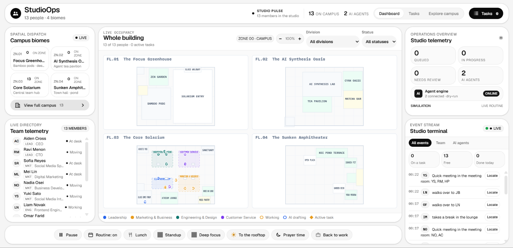

# StudioOps



<h3>StudioOps is a modern operations dashboard & 3D spatial orchestration engine for virtual studios. It includes:</h3>

- **Modern Open-Plan 3D Campus**: Realistic architectural visualization built with Three.js across four distinct biophilic biomes
- **Live 2D Spatial Floor Plan**: High-density interactive dispatch map in the Mission Control Bento Grid
- **Workspace Layout Engine**: Instant dynamic toggle between **Open-Plan** (unobstructed modern layout) and **Original** (enclosed partitions)
- **Interactive 3D Object Inspector**: Click-to-inspect raycasting with live bounding-box highlights on workstations, conference suites, phone booths, amphitheaters, koi ponds, and biophilic planters
- **Camera Toolbar & Presets**: Dedicated toolbar for Orbit, Isometric, Walkway Eye-Level, and 2D Map views
- **Team Roster & Telemetry**: Real-time activity, division filters, and location command dispatchers
- **Task Hub & AI Monitoring**: Kanban and agenda task workflows with version review and agent drafts

<br>

## Campus Architecture & Biomes

StudioOps implements the authoritative spatial coordinates, floor elevations, and dimensions from `BLUEPRINT.md` with a premium architectural visual concept:
**White Architectural Walls (`#F7F7F5`) + Walnut Furniture (`#4A2F20`) + Light Marble Flooring (`#D8D5CE`) + Black Ergonomic Task Chairs (`#111111`) + STC-42 Acoustic Glass Partitions + Indoor Greenery**.

### The 4 Campus Biomes

1. **ZN.01 · Focus Greenhouse** (`Level 01` · Elevation `0.0m`):
   - Central living moss & stone terrarium lounge at `(0, 0)` with ficus and granite boulders
   - Acoustic bamboo focus pods at `X = -8.0, Z = ±4.0` with sound-absorbing felt and cedar slats
   - Collaborative felt lounge at `(8.0, -4.0)` with upholstered charcoal armchairs
   - Perimeter window planter troughs along North and South glazing with Monstera Deliciosa and Sansevieria

2. **ZN.02 · AI Synthesis Oasis** (`Level 02` · Elevation `4.4m`):
   - Three 8-person walnut developer workstation islands (Island A, B, C) along `Z = 5.5` with dual 4K monitors and acoustic screens
   - Traditional Tatami tea pavilion at `(-6.0, -2.0)` with cedar deck and solid walnut low table
   - Four 5.5m microLED active telemetry displays on the North wall (`Z = -11.86m`)
   - Fluted walnut matcha & espresso bar at `(13.5, -3.0)`

3. **ZN.03 · Core Solarium** (`Level 03` · Elevation `8.8m`):
   - Continuous unobstructed 2.5m central walkway (`Z = -1.25m` to `+1.25m`) with recessed floor LED guide lines
   - Four modular walnut benching clusters for Leadership, Marketing, Engineering, and Customer Service
   - Acoustic glass conference forum suite at `(-12.9, -9.25)` with boat-shaped walnut table and 75" presentation wall
   - Soundproof PET acoustic phone booths at `(-14.6, 10.5)` and `(-12.4, 10.5)`
   - Living moss pantry & cafe bar at `(11.8, -10.3)`
   - Quiet sanctuary & prayer room at `(13.3, 10.15)`

4. **ZN.04 · Sunken Amphitheater** (`Level 04` · Elevation `13.2m`):
   - **Sunken Cedar Amphitheater** at `(-1.0, 3.5)`: Three tiered cedar risers with warm recessed LED step-lighting, charcoal acoustic cushions, walnut stage, dark metal lectern, and 120" AV presentation display
   - **Reflective Koi Pond** at `(3.0, 9.0)`: Honed granite basin rim with mirror water surface, 5 floating natural slate stepping stones, and Japanese water lanterns
   - **Timber Pergola Executive Canopy** at `(-6.0, -6.5)`: Cedar rafters, modular L-shaped outdoor sofa, and walnut coffee table
   - **Recreation Zone**: Tournament billiards table, architectural ping pong, artisan inlaid chess table, yoga meadow, and rooftop espresso bar

---

## Interactive Systems & 3D HUD

- **In-Canvas HUD (Left Panel)**:
  - Quick-switch buttons for all 4 campus biomes and Full Campus view.
  - Active workspace layout toggle: **Original** vs. **Open Plan**.
- **Camera Toolbar (Bottom)**:
  - `⟲ Orbit`: Smooth orbital camera around the active floor.
  - `◧ Isometric`: Classic isometric axonometric perspective.
  - `👁 Walkway`: Eye-level perspective along the central walkway.
  - `⊞ 2D Map`: Orthographic-style top-down plan view.
  - `⮂ Toggle Layout`: One-click toggle between open-plan and original partitions.
- **Object Inspector (Right Panel)**:
  - Raycasts and identifies any clicked 3D facility, workstation island, glass partition, conference room, phone booth, amphitheater, or koi pond.
  - Highlights the selected object with an active cyan bounding box (`THREE.BoxHelper`).
  - Displays hardware specs, materials, capacities, and acoustic ratings.

---

## Dashboard & Operations

- **Mission Control Command Deck**: High-density Bento Grid layout featuring real-time telemetry, minimalist white aesthetic on frosted paper, studio pulse metrics, live event streams, and tactical action dispatchers.
- **Team Roster & Telemetry**: Real-time status for 13 team members across 4 divisions, with interactive filtering, 3D camera follow, and location commands (Standup, Lunch, Deep Focus, Rooftop, Back to work).
- **Task Hub**: Kanban columns (Queued, In Progress, Needs Decision, Review, Done) with priority management, dependency tracking, and assignee suggestions.
- **AI Agent Monitoring**: Version review and draft approval workflow for autonomous studio tasks.

---

## Keyboard Shortcuts

| Shortcut | Action |
|---|---|
| `D` | Switch to Dashboard view |
| `T` | Switch to Tasks view |
| `E` | Switch to 3D Explore Campus view |
| `N` | Open New Task dialog |
| `1`–`4` | Switch campus biomes (`ZN.01` Focus Greenhouse to `ZN.04` Amphitheater) |
| `0` | View full campus overview |
| `/` | Focus division search or filter |
| `Esc` | Return to Dashboard from 3D Explore or exit follow camera |
| `?` | Open keyboard shortcuts help modal |

---

## Requirements & Setup

- **Node.js**: 22 or later
- **npm**: 9 or later

### Installation

```bash
npm install
```

Copy the example environment file:

```bash
cp .env.example .env
```

### Running the Application

Start the development server (runs on port 3000):

```bash
npm run dev
```

Open [http://localhost:3000](http://localhost:3000) in your browser.

Build for production:

```bash
npm run build
```

Start the production full-stack server:

```bash
npm start
```

---

## Project Structure

```
.
├── index.html              # Main application entry point (Bento Dashboard & 3D Shell)
├── metadata.json           # AI Studio applet metadata & capabilities
├── package.json            # Node.js dependencies and scripts
├── vite.config.js          # Vite configuration with backend API proxy middleware
├── BLUEPRINT.md            # Authoritative architectural dimensions and zoning framework
├── DESIGN.md               # Design tokens, typography, and styling constitution
├── README.md               # Project documentation and feature guide
├── data/
│   └── tasks.json          # Persistent task storage
├── public/
│   ├── favicon.svg         # Application icon
│   ├── music.js            # Ambient relaxing audio synthesis
│   ├── office.css          # 3D canvas and explore styles
│   ├── office.js           # Core Three.js WebGL simulation engine & open-plan campus
│   ├── tasks.css           # Task dialog & Kanban styles
│   └── tasks.js            # In-memory and server task synchronization
├── server/
│   ├── server.js           # Backend API server for tasks and simulated AI agents
│   └── agents.js           # Autonomous agent execution and prompt runner
└── src/
    ├── main.js             # Main application orchestrator & view switching
    ├── dashboard/          # Mission control bento & 2D floor plan modules
    ├── styles/             # Bento dashboard and 3D HUD CSS stylesheets
    └── tasks/              # Task hub, agent monitor, and version review UI
```

---

## License

Distributed under the [MIT License](LICENSE).