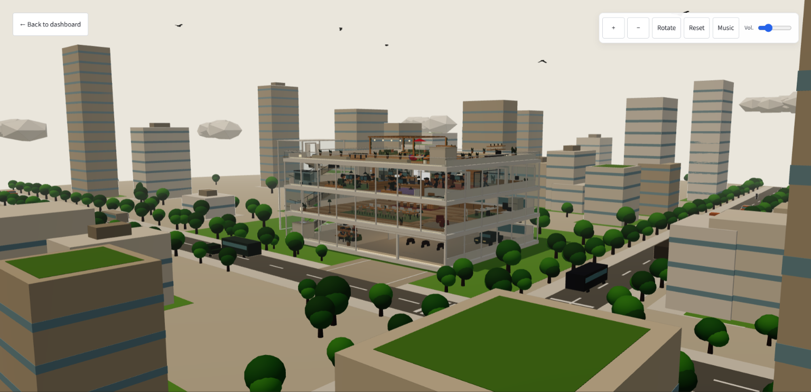
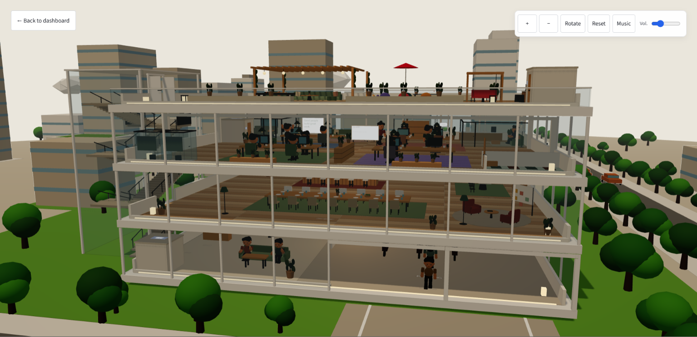
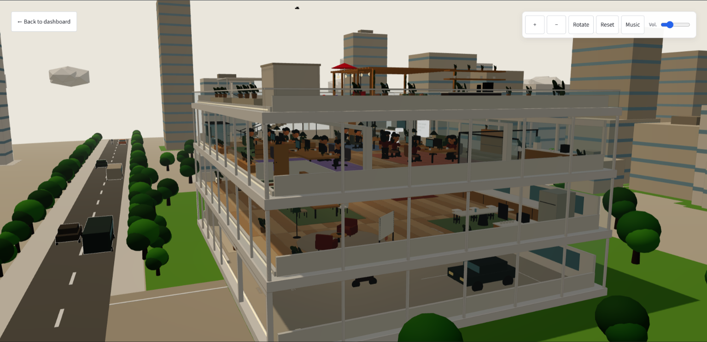
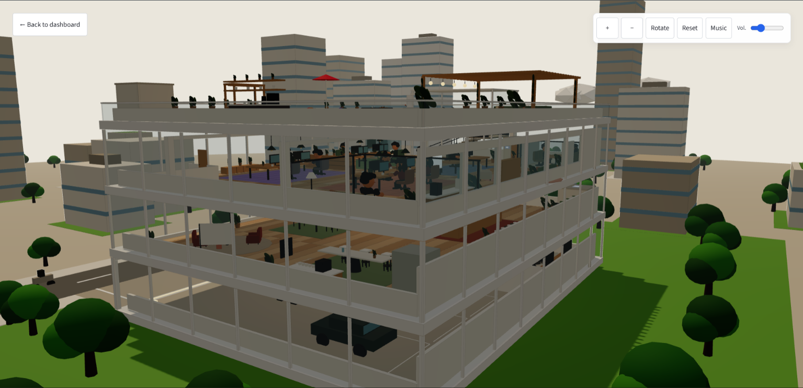
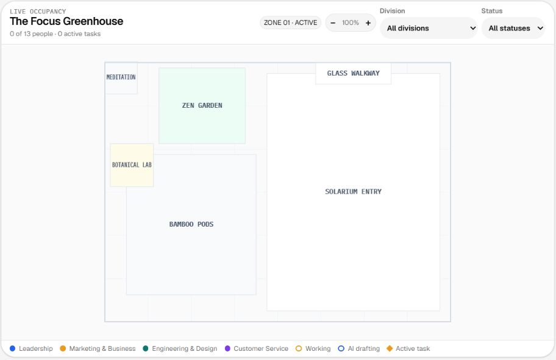
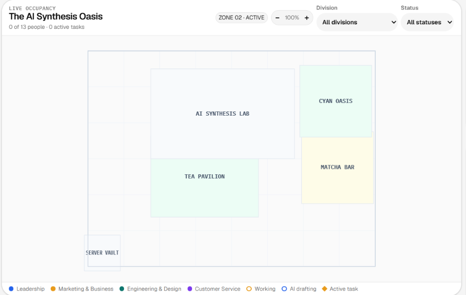
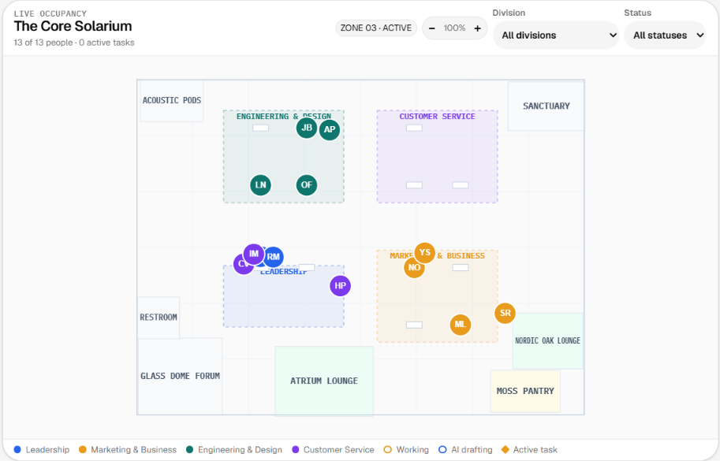
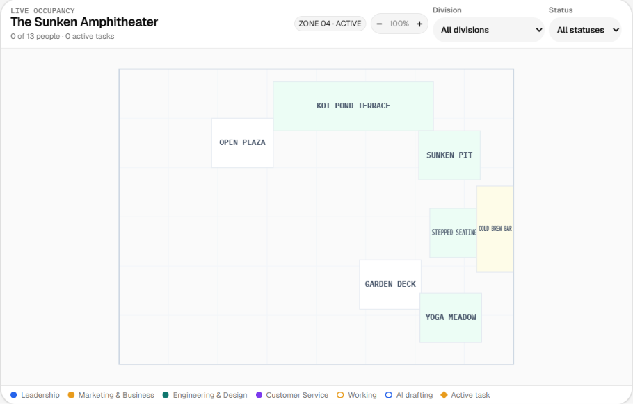

# StudioOps


<h3>StudioOps AI is an operations dashboard for managing a virtual studio. It includes:</h3>

- A live 2D interactive spatial map across four interconnected biophilic biomes
- Team roster and real-time status management
- Kanban and agenda task views
- Workload and dependency tracking
- AI agent monitoring and draft comparison
- Optional 3D campus exploration & character follow camera

<br>


## Features

### Dashboard & Spatial Campus

- **Mission Control Command Deck**: High-density Bento Grid layout featuring real-time telemetry, minimalist white aesthetic on frosted paper, studio pulse metrics, live event streams, and tactical action dispatchers.
- **Live Campus Biomes**:
  - `ZN.01`: **Focus Greenhouse** — Quiet bamboo pods, acoustic moss alcoves, and deep-work terrariums.
  - `ZN.02`: **AI Synthesis Oasis** — Japanese digital tea pavilion, autonomous agent stations, and live streaming monitors.
  - `ZN.03`: **Core Solarium** — Central botanical glass dome with 4 divisional team clusters and floating glass meeting pods.
  - `ZN.04`: **Sunken Amphitheater** — Stepped cedar seating, reflective koi pond, and acoustic canopy for company standups and breaks.

| |  |
| :---: | :---: |
|  |  |
|  |  |


## Campus Biomes Gallery

| ZN.01 · Focus Greenhouse | ZN.02 · AI Synthesis Oasis |
| :---: | :---: |
|  |  |
| **ZN.03 · Core Solarium** | **ZN.04 · Sunken Amphitheater** |
|  |  |
- View team members and their current status with real-time roster telemetry
- Filter by division (Leadership, Marketing, Engineering & Design, Customer Service) or status
- Select team members to view live coordinates, bios, and locations
- Send group location commands (Lunch, Standup, Deep Focus, Rooftop/Pond, Routine, Back to work)
- Review recent activity in the live studio terminal stream

### Task Hub

- Manage tasks in Kanban columns: Queued, Working, Review, and Done
- View tasks in an agenda grouped by due date
- Set priorities, due dates, and dependencies
- Identify blocked tasks
- Get assignee suggestions based on availability and division

### AI Agents

- Monitor active AI agents
- Compare draft versions
- Review approval history
- Configure the Claude model and system prompt

### Explore Campus (3D View)

The 3D campus exploration view supports:

- Dynamic biome navigation (`ZN.01`–`ZN.04` and Full Campus view)
- Free camera orbit and character tracking
- Team member focus directly from the dashboard
- Returning to the dashboard with `Esc` or `D`

## Requirements

- Node.js 18 or later
- npm 9 or later
- Node.js 22 is recommended

## Installation

```bash
git clone https://github.com/ARUNAGIRINATHAN-K/studio-ops-ai.git
cd studio-ops-ai
npm install
```

Copy the example environment file:

```bash
cp .env.example .env
```

Set `ANTHROPIC_API_KEY` in `.env` to enable AI agent generation. Without this key, the server uses simulated drafts.

## Run the Application

Start the development server:

```bash
npm run dev
```

Open [http://localhost:5173](http://localhost:5173), or use the port shown by the development server.

Start the production server:

```bash
npm start
```

The production server runs at [http://127.0.0.1:3000](http://127.0.0.1:3000).

## Run with Docker

You can run StudioOps AI inside a Docker container using Docker Compose:

```bash
docker compose up -d
```

## Keyboard Shortcuts

| Shortcut | Action |
|---|---|
| `D` | Open Dashboard |
| `T` | Open Tasks |
| `E` | Open Explore Campus |
| `N` | Open the New Task dialog |
| `1`–`4` | Switch campus biomes (Greenhouse, AI Oasis, Core Solarium, Amphitheater) |
| `0` | View full campus overview |
| `/` | Focus division search or filter |
| `Esc` | Return to Dashboard from Explore |

## Testing

Run the full Playwright test suite:

```bash
npm test
```

Run individual test modules:

```bash
node tests/dashboard.cjs
node tests/kanban.cjs
node tests/agent-review.cjs
node tests/server.cjs
```

## License

Distributed under the [MIT License](LICENSE).